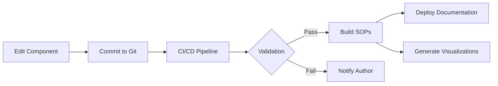
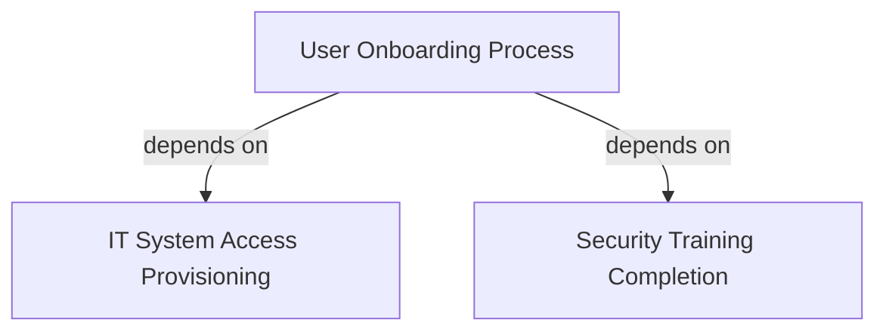

# 🔷 SOP Ecosystem - Proof of Concept

> A modern, graph-based approach to managing Standard Operating Procedures using modular components, docs-as-code methodology, and automated tooling.

[]()
[]()
[]()

## 📋 Table of Contents

- [Overview](#overview)
- [Core Concepts](#core-concepts)
- [Architecture](#architecture)
- [Getting Started](#getting-started)
- [Usage](#usage)
- [Tools](#tools)
- [Project Structure](#project-structure)
- [Examples](#examples)
- [CI/CD Integration](#cicd-integration)
- [Best Practices](#best-practices)
- [Contributing](#contributing)

---

## 🎯 Overview

This proof of concept demonstrates a revolutionary approach to managing Standard Operating Procedures (SOPs) that combines:

- **📊 Graph-Based Architecture**: SOPs and components modeled as nodes with explicit dependencies
- **🧩 Modular Components**: Atomic design principles (atoms, molecules, organisms) for maximum reusability
- **📝 Docs-as-Code**: Version control, automation, and collaboration using developer workflows
- **🔄 Living Documentation**: SOPs that automatically update and assemble from components
- **📈 Impact Analysis**: Understand change propagation before making modifications
- **🎨 Visual Tools**: Interactive visualizations of SOP relationships

### Key Benefits

✅ **Reduce Duplication**: Write once, reuse everywhere
✅ **Change Confidence**: Know exactly what's affected before you make changes
✅ **Automatic Assembly**: Build complete SOPs from modular components
✅ **Version Control**: Full audit trail using Git
✅ **Collaboration**: Pull requests, reviews, and approvals for SOP changes
✅ **Automation**: CI/CD pipelines for validation and publishing

---

## 💡 Core Concepts

### 1. Atomic Design for Documentation

Inspired by atomic design in UI development, we structure SOPs hierarchically:

```
Atoms (⚛️)
└─ Smallest reusable units
   └─ Examples: Forms, checklists, definitions

Molecules (🔹)
└─ Combinations of atoms
   └─ Examples: Multi-step procedures, approval workflows

Organisms (🔷)
└─ Complete functional workflows
   └─ Examples: Full onboarding process, system provisioning

SOPs (📄)
└─ Complete Standard Operating Procedures
   └─ Assembled from organisms, molecules, and atoms
```

**Example Flow**:

```
atom-access-request-form
    ↓ (used in)
molecule-credential-creation
    ↓ (used in)
organism-system-access-workflow
    ↓ (used in)
sop-002 (IT System Access Provisioning)
```

### 2. Graph-Based Dependencies

All SOPs and components are nodes in a graph with explicit relationships:

```json
{
  "edges": [
    {
      "source": "sop-001",
      "target": "sop-002",
      "type": "depends-on",
      "strength": "strong",
      "description": "User onboarding requires IT system access"
    }
  ]
}
```

**Relationship Types**:

- `depends-on`: Strong dependency between SOPs
- `related-to`: Weak relationship (reference)
- `component-of`: Component used in larger unit
- `uses-component`: SOP uses a specific component

### 3. Docs-as-Code Workflow



### 4. Impact Analysis

Before making changes, understand the ripple effects:

```bash
$ npm run impact -- atom-access-request-form

📊 Impact Analysis Results:
├─ Direct Impacts: 3
│  ├─ molecule-account-setup
│  ├─ molecule-credential-creation
│  └─ sop-002
├─ Downstream Impacts: 5
└─ Risk Level: MEDIUM

Recommendation: Review affected documents, notify stakeholders
```

---

## 🏗️ Architecture

### System Components

```
┌─────────────────────────────────────────────────────────────┐
│                        User Interface                        │
│  (Web Server, CLI Tools, Interactive Visualizations)        │
└────────────────┬────────────────────────────────────────────┘
                 │
┌────────────────┴────────────────────────────────────────────┐
│                      Automation Layer                        │
│  ┌─────────┐  ┌─────────┐  ┌──────────┐  ┌──────────┐     │
│  │ Builder │  │Validator│  │  Impact  │  │Visualizer│     │
│  │         │  │         │  │ Analyzer │  │          │     │
│  └─────────┘  └─────────┘  └──────────┘  └──────────┘     │
└────────────────┬────────────────────────────────────────────┘
                 │
┌────────────────┴────────────────────────────────────────────┐
│                      Data Layer                              │
│  ┌──────────────────┐         ┌──────────────────┐         │
│  │  Graph Database  │◄───────►│    Components    │         │
│  │  (sop-graph.json)│         │ (atoms/molecules)│         │
│  └──────────────────┘         └──────────────────┘         │
└─────────────────────────────────────────────────────────────┘
```

### Data Flow

1. **Component Creation**: Author creates/edits modular components (atoms, molecules, organisms)
2. **Graph Definition**: Relationships defined in `graph/sop-graph.json`
3. **Validation**: System validates references, versions, and structure
4. **Building**: Automated assembly of complete SOPs from components
5. **Publishing**: Generated SOPs published to distribution directory
6. **Visualization**: Interactive graphs generated for exploration

---

## 🚀 Getting Started

### Prerequisites

- **Node.js** v18+ (v20 recommended)
- **Git** for version control
- **npm** or **yarn** package manager

### Installation

```bash
# Clone the repository
git clone <repository-url>
cd SOPDemo

# Install dependencies
npm install

# Verify installation
npm run validate
```

### Quick Start

```bash
# 1. Build all SOPs
npm run build

# 2. Generate visualizations
npm run visualize

# 3. Start development server
npm run serve

# 4. Open browser to http://localhost:8080
```

You should see:

- ✅ 4 built SOPs
- ✅ Interactive HTML visualization
- ✅ Build and validation reports

---

## 📖 Usage

### Building SOPs

Build all SOPs from components:

```bash
npm run build
```

Build a specific SOP:

```bash
node tools/build.js sop-001
```

**Output**: Built SOPs are saved to `dist/sops/`

### Impact Analysis

Analyze the impact of changing a component:

```bash
# Analyze a specific component
npm run impact -- atom-access-request-form

# Analyze with custom depth
npm run impact -- sop-001 --depth=5
```

**Output**:

- Terminal visualization of impact tree
- JSON report in `dist/impact-analysis/`

### Visualization

Generate visualizations in different formats:

```bash
# Interactive HTML (recommended)
npm run visualize -- --format=html

# Mermaid diagram (for GitHub/docs)
npm run visualize -- --format=mermaid

# DOT format (for Graphviz)
npm run visualize -- --format=dot

# ASCII art (terminal viewing)
npm run visualize -- --format=ascii
```

**Output**: Visualizations saved to `dist/visualizations/`

### Validation

Validate the entire SOP ecosystem:

```bash
# Standard validation
npm run validate

# Strict mode (warnings become errors)
npm run validate -- --strict
```

**Checks**:

- ✅ Graph structure integrity
- ✅ Component references validity
- ✅ Circular dependency detection
- ✅ Version format compliance
- ✅ Metadata completeness

### Development Server

Start a local server to view documentation:

```bash
npm run serve
# or specify port
npm run serve -- --port=3000
```

Navigate to `http://localhost:8080` to:

- View built SOPs
- Explore interactive visualizations
- Access build reports
- Browse component library

---

## 🛠️ Tools

### 1. Builder (`tools/build.js`)

**Purpose**: Assembles complete SOPs from modular components

**Features**:

- Processes component includes (`{{include: component-id}}`)
- Resolves references (`{{reference: component-id}}`)
- Generates dependency sections
- Adds metadata and change history
- Creates build reports

**Usage**:

```bash
node tools/build.js [sop-id]
```

### 2. Impact Analyzer (`tools/impact-analysis.js`)

**Purpose**: Analyzes change propagation through dependency graph

**Features**:

- Traverses dependency graph
- Identifies all affected documents
- Calculates risk levels
- Provides recommendations
- Exports detailed reports

**Usage**:

```bash
node tools/impact-analysis.js <node-id> [--depth=N]
```

**Risk Levels**:

- 🟢 **Low**: 0-2 direct impacts
- 🟡 **Medium**: 3-5 direct impacts
- 🔴 **High**: 6-10 direct impacts
- 🟣 **Critical**: 10+ direct impacts

### 3. Visualizer (`tools/visualize.js`)

**Purpose**: Generates visual representations of SOP graph

**Formats**:

- **HTML**: Interactive, filterable graph viewer
- **Mermaid**: Diagrams for GitHub/documentation
- **DOT**: For Graphviz rendering
- **ASCII**: Terminal-friendly visualization

**Usage**:

```bash
node tools/visualize.js --format=<format> [--output=file]
```

### 4. Validator (`tools/validate.js`)

**Purpose**: Ensures ecosystem integrity

**Validations**:

- Graph structure consistency
- Component reference validity
- Circular dependency detection
- Semantic version format
- Metadata completeness
- Broken link detection

**Usage**:

```bash
node tools/validate.js [--strict]
```

### 5. Server (`tools/serve.js`)

**Purpose**: Local development server

**Features**:

- Serves built documentation
- Auto-refreshing index page
- File browsing
- MIME type handling

**Usage**:

```bash
node tools/serve.js [--port=8080]
```

---

## 📁 Project Structure

```
SOPDemo/
├── 📄 README.md                      # This file
├── 📦 package.json                   # Project configuration
├── 🔧 .gitignore                     # Git ignore rules
│
├── 📂 sop-components/                # Modular components
│   ├── atoms/                        # Smallest reusable units
│   │   ├── welcome-message.md
│   │   ├── access-request-form.md
│   │   ├── training-modules.md
│   │   └── equipment-form.md
│   │
│   ├── molecules/                    # Multi-step procedures
│   │   ├── account-setup.md
│   │   ├── credential-creation.md
│   │   └── approval-chain.md
│   │
│   └── organisms/                    # Complete workflows
│       ├── first-day-workflow.md
│       └── system-access-workflow.md
│
├── 📂 graph/                         # Graph database
│   └── sop-graph.json               # Node and edge definitions
│
├── 📂 templates/                     # Component templates
│   ├── atom-template.md
│   ├── molecule-template.md
│   └── organism-template.md
│
├── 📂 tools/                         # Automation tools
│   ├── build.js                      # SOP builder
│   ├── impact-analysis.js            # Change impact analyzer
│   ├── visualize.js                  # Graph visualizer
│   ├── validate.js                   # Structure validator
│   └── serve.js                      # Development server
│
├── 📂 config/                        # Configuration
│   └── sop-config.json              # System settings
│
├── 📂 dist/                          # Build output
│   ├── sops/                         # Built SOPs
│   ├── visualizations/               # Generated visualizations
│   ├── impact-analysis/              # Impact reports
│   ├── build-report.json            # Build summary
│   └── validation-report.json       # Validation results
│
├── 📂 tests/                         # Test files (future)
│
└── 📂 .github/                       # GitHub specific
    └── workflows/                    # CI/CD pipelines
        └── build-and-publish.yml    # Automated build workflow
```

---

## 📚 Examples

### Example 1: Creating a New Atom

```bash
# 1. Copy template
cp templates/atom-template.md sop-components/atoms/new-atom.md

# 2. Edit the atom
# - Set unique ID
# - Add content
# - Define version

# 3. Register in graph
# Edit graph/sop-graph.json to add node definition

# 4. Validate
npm run validate

# 5. Build
npm run build
```

### Example 2: Analyzing Impact Before Changes

```bash
# Before modifying atom-access-request-form
npm run impact -- atom-access-request-form

# Output shows:
# - 2 molecules use it (account-setup, credential-creation)
# - 2 SOPs affected (sop-001, sop-002)
# - Risk level: MEDIUM
# - Recommendation: Review all affected documents

# Now you can confidently make changes knowing the scope
```

### Example 3: Adding a New SOP

```markdown
<!-- 1. Add to graph/sop-graph.json -->
{
  "sop-005": {
    "id": "sop-005",
    "type": "sop",
    "title": "New Employee Offboarding",
    "version": "1.0.0",
    "status": "active",
    "owner": "HR Department",
    "components": [
      "atom-exit-interview",
      "molecule-account-termination",
      "organism-offboarding-workflow"
    ]
  }
}

<!-- 2. Create required components -->
<!-- 3. Define dependencies -->
<!-- 4. Build and validate -->
```

### Example 4: Using Components in SOPs

```markdown
---
id: organism-custom-workflow
type: organism
composedOf:
  - atom-welcome-message
  - molecule-account-setup
---

# Custom Workflow

## Phase 1: Welcome

{{include: atom-welcome-message}}

## Phase 2: Account Setup

{{include: molecule-account-setup}}

<!-- Components are automatically included during build -->
```

---

## 🔄 CI/CD Integration

### GitHub Actions Workflow

The POC includes a complete CI/CD pipeline (`.github/workflows/build-and-publish.yml`):

**Triggered on**:

- Push to `main` or `develop` branches
- Pull requests to `main`
- Manual workflow dispatch

**Pipeline Stages**:

1. **Validation**
   - Validates graph structure
   - Checks component references
   - Detects circular dependencies
   - Uploads validation report

2. **Build**
   - Builds all SOPs
   - Generates visualizations (Mermaid, HTML, DOT)
   - Creates build artifacts
   - Uploads to GitHub Pages (on main branch)

3. **Impact Analysis**
   - Runs impact analysis on critical components
   - Generates impact reports
   - Identifies high-risk changes

4. **PR Comments**
   - Automatically comments on PRs with build results
   - Shows what SOPs were built/failed
   - Provides summary statistics

### Example PR Comment

```markdown
## 📊 SOP Build Report

✅ **Build Status**: Success

### Summary
- **Total SOPs**: 4
- **Successful**: 4
- **Failed**: 0

### Built SOPs
- sop-001: success
- sop-002: success
- sop-003: success
- sop-004: success

*Generated on 2025-11-12T10:30:00Z*
```

---

## 🎯 Best Practices

### 1. Component Design

✅ **DO**:

- Keep atoms focused on single purpose
- Use semantic versioning
- Document dependencies clearly
- Include metadata in frontmatter
- Write reusable content

❌ **DON'T**:

- Mix multiple concepts in one atom
- Create deep nesting (max 3 levels)
- Hard-code organization-specific details in reusable components
- Skip version numbers
- Create circular dependencies

### 2. Graph Management

✅ **DO**:

- Use descriptive edge types
- Document why dependencies exist
- Mark strong dependencies explicitly
- Keep graph schema consistent
- Validate after every change

❌ **DON'T**:

- Create circular dependencies
- Use vague relationship descriptions
- Mix different relationship semantics
- Skip metadata on critical relationships

### 3. Version Control

✅ **DO**:

- Commit atomic changes
- Write descriptive commit messages
- Use feature branches for major changes
- Tag releases with semantic versions
- Review all SOP changes via PRs

❌ **DON'T**:

- Commit broken validation
- Skip CI/CD checks
- Push directly to main
- Forget to update version numbers

### 4. Impact Analysis

✅ **DO**:

- Run impact analysis before major changes
- Review all affected documents
- Notify stakeholders of downstream impacts
- Consider phased rollouts for high-risk changes
- Document impact analysis results

❌ **DON'T**:

- Skip impact analysis for "small" changes
- Ignore downstream dependencies
- Make breaking changes without coordination

---

## 🎨 Visualization Examples

### Interactive HTML Visualization

The HTML visualization provides:

- **Filtering**: By node type (SOP, organism, molecule, atom)
- **Search**: Find nodes by ID or title
- **Statistics**: Real-time counts and metrics
- **Navigation**: Click to explore dependencies
- **Color Coding**: Visual distinction by type

### Mermaid Diagram



---

## 🧪 Testing the POC

### Quick Validation

```bash
# 1. Validate structure
npm run validate
# Expected: ✓ VALIDATION PASSED

# 2. Build all SOPs
npm run build
# Expected: ✓ 4 SOPs built successfully

# 3. Test impact analysis
npm run impact -- atom-access-request-form
# Expected: Shows 2 direct impacts, MEDIUM risk

# 4. Generate visualization
npm run visualize -- --format=html
# Expected: HTML file created in dist/visualizations/

# 5. Start server
npm run serve
# Expected: Server running on http://localhost:8080
```

### Manual Testing Checklist

- [ ] All SOPs build without errors
- [ ] Impact analysis runs for each component type
- [ ] HTML visualization loads and is interactive
- [ ] Validation passes with no errors
- [ ] Server serves all files correctly
- [ ] Component includes work properly
- [ ] Dependency tracking is accurate

---

## 📈 Metrics & Monitoring

Track these KPIs to measure ecosystem health:

### Build Metrics

- **Build Success Rate**: Target >99%
- **Build Time**: Track average build duration
- **Failed Builds**: Monitor and investigate failures

### Quality Metrics

- **Validation Pass Rate**: Target 100%
- **Component Reuse**: % of components used in multiple SOPs
- **Broken References**: Target 0

### Impact Metrics

- **High-Risk Changes**: Count of changes affecting 10+ documents
- **Impact Analysis Coverage**: % of changes analyzed before commit
- **Stakeholder Notification Rate**: % of affected parties notified

---

## 🔮 Future Enhancements

Potential additions to expand the POC:

1. **Advanced Features**
   - [ ] Automated version bumping
   - [ ] Diff viewer for SOP changes
   - [ ] Approval workflow integration
   - [ ] Comment/annotation system
   - [ ] Change request tracking

2. **Database Integration**
   - [ ] Neo4j or PostgreSQL backend
   - [ ] Real-time graph queries
   - [ ] Advanced analytics
   - [ ] Full-text search

3. **Collaboration**
   - [ ] Real-time editing
   - [ ] Discussion threads
   - [ ] Review assignments
   - [ ] Notification system

4. **AI/ML Enhancements**
   - [ ] Automatic dependency detection
   - [ ] Similarity analysis
   - [ ] Smart recommendations
   - [ ] Auto-generated summaries

5. **Integrations**
   - [ ] Slack/Teams notifications
   - [ ] JIRA/Linear integration
   - [ ] SSO authentication
   - [ ] Export to PDF/DOCX

---

## 🤝 Contributing

### Adding New Components

1. Use templates from `templates/` directory
2. Follow naming conventions: `type-descriptive-name.md`
3. Include complete frontmatter
4. Add to graph definition
5. Run validation before committing

### Modifying Existing Components

1. Run impact analysis first
2. Update version number (semantic versioning)
3. Document changes in frontmatter
4. Notify affected stakeholders
5. Submit PR with impact analysis results

### Reporting Issues

- Check existing issues first
- Provide validation output
- Include build logs if applicable
- Describe expected vs actual behavior

---

## 📄 License

This project is licensed under the MIT License.

---

## 🙏 Acknowledgments

This proof of concept is inspired by:

- **Atomic Design** methodology by Brad Frost
- **DITA** (Darwin Information Typing Architecture)
- **Docs-as-Code** movement
- **Graph Database** concepts
- **Systems Thinking** principles

---

## 📞 Support

For questions, issues, or contributions:

- 📧 Email: [your-email]
- 💬 Discussions: [GitHub Discussions]
- 🐛 Issues: [GitHub Issues]
- 📖 Documentation: [Wiki]

---

## 🎓 Learn More

### Recommended Reading

- [Atomic Design Methodology](https://atomicdesign.bradfrost.com/)
- [DITA Best Practices](https://www.oasis-open.org/committees/dita/)
- [Docs as Code](https://www.writethedocs.org/guide/docs-as-code/)
- [Systems Thinking for Business](https://www.systems-thinking.org/)
- [Graph Databases](https://neo4j.com/developer/graph-database/)

### Related Projects

- [MadCap Flare](https://www.madcapsoftware.com/products/flare/) - Professional documentation tool
- [Paligo](https://paligo.net/) - Cloud-based CCMS
- [MkDocs](https://www.mkdocs.org/) - Static site generator for docs
- [Docusaurus](https://docusaurus.io/) - Documentation website framework

---

<div align="center">

**Built with ❤️ using Node.js, Markdown, and Graph Theory**

[⬆ Back to Top](#-sop-ecosystem---proof-of-concept)

</div>
