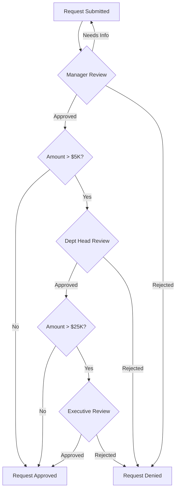

# Multi-Level Approval Process

## Overview

This reusable approval chain workflow can be adapted for various approval scenarios including equipment requests, access requests, budget approvals, and policy changes.

## Standard Approval Levels

### Level 1: Manager Approval
**Required for**: All requests
**Timeline**: 1-2 business days
**Criteria**:
- Business need justified
- Within team budget/scope
- Aligns with team objectives

**Actions**:
- Review request details
- Verify business justification
- Approve, reject, or request modifications
- Add approval signature and date

### Level 2: Department Head Approval
**Required for**: Requests over $5,000 or cross-department impact
**Timeline**: 2-3 business days
**Criteria**:
- Aligns with department strategy
- Budget availability confirmed
- No conflicts with other initiatives

**Actions**:
- Review manager's approval and justification
- Assess department-wide impact
- Verify budget allocation
- Provide final department approval

### Level 3: Executive Approval
**Required for**: Requests over $25,000, new headcount, or major policy changes
**Timeline**: 3-5 business days
**Criteria**:
- Strategic alignment with company goals
- ROI justification provided
- Risk assessment completed

**Actions**:
- Review complete approval chain
- Assess company-wide implications
- Consider timing and resource allocation
- Provide executive decision

## Approval Workflow

## Escalation Procedures

### Approval Delays
If approval is pending beyond expected timeline:
1. **Day 3**: Automated reminder sent to approver
2. **Day 5**: Escalate to approver's manager
3. **Day 7**: Escalate to department head

### Approval Disputes
If request is rejected:
1. Requestor can request written justification
2. Requestor can appeal with additional information
3. Appeals reviewed by next level in chain

## Special Approval Types

### Emergency/Urgent Requests
- Tag request as "URGENT" with justification
- Reduced approval timeline (24-48 hours)
- Requires explicit emergency justification
- Post-approval review may be required

### Recurring/Scheduled Approvals
- Annual renewals can use simplified approval
- Reference previous year's approval
- Only changes require full review

### Delegated Approval Authority
- Approvers can delegate during absence
- Delegation must be documented in system
- Delegate has same approval limits as original approver

## Audit Trail Requirements

For each approval action, record:
- Approver name and role
- Date/time of approval decision
- Decision (approved/rejected/needs more info)
- Comments/justification
- Supporting documentation references

## Compliance Notes

- All approvals must be documented
- Approval authority cannot be self-granted
- Approvals expire after 90 days if not actioned
- Annual review of approval thresholds required

---
**Note**: This approval chain can be customized based on organizational structure and specific requirements. Adjust threshold amounts and approval levels as needed.
