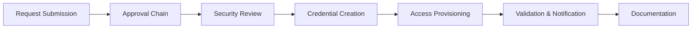

# Complete System Access Provisioning Workflow

## Overview

This organism represents the complete end-to-end workflow for provisioning system access, from request submission through final access validation.

## Workflow Stages



---

## Stage 1: Request Submission

### Requestor Actions

**Step 1**: Complete access request form

{{include: access-request-form}}

**Step 2**: Submit to manager for approval

- Email form to direct manager
- Include business justification
- Specify urgency if time-sensitive

### Automatic Actions

- Request logged in IT ticketing system
- Unique request ID generated
- Requestor receives confirmation email
- Approval notifications sent

---

## Stage 2: Approval Chain

{{include: approval-chain}}

### Access Request Specific Approvals

**Standard Access** (Email, Basic Tools):

- Level 1: Manager approval only
- Timeline: 24 hours
- Auto-approved for standard new hires

**Elevated Access** (CRM, Financial Systems):

- Level 1: Manager approval
- Level 2: Department head approval
- Level 3: IT Security review
- Timeline: 2-3 business days

**Privileged Access** (Admin Rights, Production Systems):

- Level 1: Manager approval
- Level 2: Department head approval
- Level 3: IT Security review
- Level 4: CISO approval
- Additional: Background check verification required
- Timeline: 5-7 business days

### Approval Decision Points

Each approver must verify:

- ✓ Business need is legitimate
- ✓ Principle of least privilege applied
- ✓ Access level appropriate for role
- ✓ No security red flags
- ✓ Compliance requirements met

---

## Stage 3: Security Review

### IT Security Team Actions

**Risk Assessment**:

```
Low Risk: Standard business applications
Medium Risk: Systems with sensitive data
High Risk: Administrative access, production systems
Critical: Financial systems, executive access
```

**Security Checks**:

- [ ] Employee background check completed
- [ ] No conflicting access (separation of duties)
- [ ] Compliance training completed
- [ ] MFA capability confirmed
- [ ] Device security requirements met

**Additional Requirements by Risk Level**:

| Risk Level | Additional Requirements |
|------------|------------------------|
| Low | Standard MFA |
| Medium | MFA + Device compliance check |
| High | MFA + Device encryption + VPN required |
| Critical | All above + Hardware security key + Manager attestation |

---

## Stage 4: Credential Creation

{{include: credential-creation}}

### Provisioning Checklist

IT Admin performs:

**Account Creation**:

- [ ] User account created in Active Directory
- [ ] Email address configured
- [ ] User added to appropriate security groups
- [ ] License assignments completed

**System-Specific Setup**:

- [ ] CRM: Profile created, territory assigned
- [ ] Financial: Role-based access configured
- [ ] Development: Repository access granted
- [ ] Project Tools: Added to relevant projects

**Security Configuration**:

- [ ] MFA enabled and enrollment link sent
- [ ] Password complexity enforced
- [ ] Session timeout configured
- [ ] Login alerts enabled
- [ ] IP restrictions applied (if required)

---

## Stage 5: Access Validation

### Pre-Delivery Testing

IT verifies:

- [ ] Can successfully login to all systems
- [ ] Appropriate permissions present
- [ ] No excessive permissions granted
- [ ] MFA functioning correctly
- [ ] All requested systems accessible

### Common Validation Tests

**Email Test**:

```bash
# Verify email delivery
Send test email to new account
Verify receipt in inbox
Test send from new account
Verify delivery to external addresses
```

**System Access Test**:

```bash
# For each provisioned system:
1. Login with new credentials
2. Navigate to key functions
3. Verify read/write permissions appropriate
4. Test any integrations
5. Confirm data access scope correct
```

---

## Stage 6: Credential Delivery & User Notification

### Secure Delivery Methods

**Option 1: In-Person Handoff** (Preferred for new hires)

- Schedule 30-minute session
- Verify identity before disclosure
- Walk through first login
- Ensure MFA enrollment completed
- Answer questions

**Option 2: Secure Email** (Remote employees)

- Send to verified personal email
- Use encrypted email if available
- Include expiration time (24 hours)
- Require acknowledgment of receipt

**Option 3: Password Manager Share** (Existing employees)

- Share via enterprise password manager
- Set sharing expiration (48 hours)
- Notify via separate channel

### Notification Email Template

```
Subject: System Access Provisioned - Action Required

Hello [Employee Name],

Your access request [Request ID] has been approved and provisioned.

Systems Activated:
- Email (Microsoft 365)
- CRM System
- Project Management Tools

IMPORTANT - MFA Enrollment Required:
Before you can access these systems, you must enroll in Multi-Factor
Authentication. Click the link below to begin enrollment:

[MFA Enrollment Link]

This link expires in 24 hours.

Your temporary credentials have been securely shared via [delivery method].
You will be required to change your password on first login.

Need help? Contact IT Service Desk:
- Email: servicedesk@company.com
- Phone: extension 5555
- Portal: https://help.company.com

Thank you,
IT Department
```

---

## Stage 7: Documentation & Audit Trail

### Required Documentation

**IT Management System Records**:

```json
{
  "request_id": "REQ-2025-00123",
  "employee_id": "EMP-45678",
  "employee_name": "Jane Smith",
  "department": "Sales",
  "request_date": "2025-11-10",
  "approval_chain": [
    {
      "approver": "John Manager",
      "level": "Manager",
      "decision": "Approved",
      "date": "2025-11-10T14:30:00Z"
    },
    {
      "approver": "Sarah Director",
      "level": "Department Head",
      "decision": "Approved",
      "date": "2025-11-11T09:15:00Z"
    }
  ],
  "security_review": {
    "reviewer": "Mike Security",
    "risk_level": "Medium",
    "decision": "Approved",
    "date": "2025-11-11T11:45:00Z",
    "conditions": ["MFA required", "Device compliance check"]
  },
  "systems_provisioned": [
    {
      "system": "Email",
      "access_level": "Standard User",
      "provisioned_by": "IT Admin",
      "date": "2025-11-11T13:00:00Z"
    },
    {
      "system": "CRM",
      "access_level": "Sales Representative",
      "provisioned_by": "IT Admin",
      "date": "2025-11-11T13:15:00Z"
    }
  ],
  "mfa_status": "Enrolled",
  "mfa_enrollment_date": "2025-11-11T15:30:00Z",
  "status": "Completed",
  "completed_date": "2025-11-11T15:30:00Z"
}
```

### Compliance Documentation

Maintain records for audit purposes:

- Original access request form with signatures
- Approval chain with dates and approvers
- Security review assessment
- Access provisioning details
- User acknowledgment of receipt
- MFA enrollment confirmation

**Retention**: Maintain for 7 years per compliance requirements

---

## Stage 8: Post-Provisioning

### 24-Hour Follow-up

IT Service Desk contacts user:

- Confirm successful login to all systems
- Verify MFA is working properly
- Address any access issues
- Answer questions about system usage

### 7-Day Access Review

Manager verifies:

- Employee is productively using systems
- Access level is appropriate
- No additional access needed
- No access should be removed

### Ongoing Monitoring

**Monthly**: IT reviews active accounts for:

- Dormant accounts (no login in 30+ days)
- Excessive permissions
- Unusual access patterns

**Quarterly**: Full access recertification

- Managers attest to appropriateness of all team access
- Identify and remove unnecessary access

**Annually**: Comprehensive access audit

- Review all privileged access
- Update access based on role changes
- Revoke access for inactive accounts

---

## Exception Handling

### Emergency Access Requests

For urgent business needs:

1. Manager emails IT Security directly
2. Explain emergency justification
3. Temporary access granted (24-48 hours)
4. Formal approval process must follow
5. Access revoked if approval denied

### Access Denials

If request denied at any stage:

1. Denial reason documented
2. Requestor and manager notified
3. Option to appeal with additional justification
4. Appeal reviewed by next approval level
5. Final decision documented

### Access Modifications

For existing users requesting additional access:

- Follow same approval workflow
- Additive permissions require same scrutiny
- Full audit trail maintained

---

## Key Performance Indicators

Track workflow efficiency:

| Metric | Target | Current |
|--------|--------|---------|
| Time to provision (standard) | < 24 hours | - |
| Time to provision (elevated) | < 3 days | - |
| Time to provision (privileged) | < 7 days | - |
| First-time MFA enrollment success | > 95% | - |
| Access provisioning accuracy | > 99% | - |
| User satisfaction (post-provisioning) | > 4.5/5 | - |

---

## Related Documentation

- **Parent SOP**: sop-002 (IT System Access Provisioning)
- **Related**: sop-001 (User Onboarding Process)
- **Component**: atom-access-request-form
- **Component**: molecule-credential-creation
- **Component**: molecule-approval-chain

---

**Document Version**: 1.0.0
**Last Updated**: 2025-11-12
**Owner**: IT Department
**Security Review**: IT Security Team
**Next Review**: 2026-02-12
