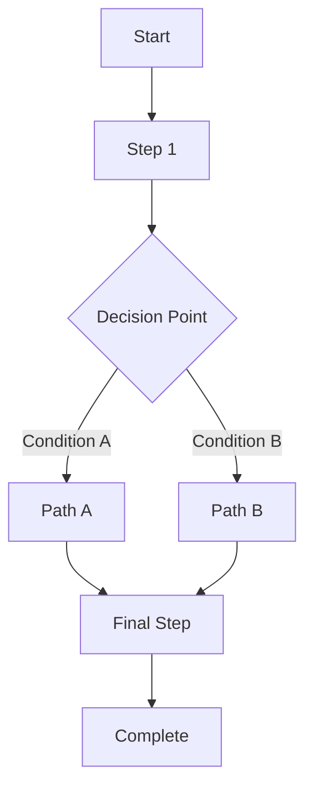

---
# ============================================================================
# METADATA HEADER - Searchability Foundation
# ============================================================================

# Core Identification (Required)
id: sop-[dept-abbrev]-[number]  # Example: sop-it-001, sop-hr-005
type: sop
version: 1.0.0
status: [draft|in-review|approved|active|archived|deprecated]
title: [Descriptive SOP Title - What Does This Procedure Accomplish?]

# Searchability & Discovery Metadata
department: [IT|Operations|HR|Finance|Legal|Compliance|Security|Customer Service|Multi-Department]
processCategory: [System Configuration|Troubleshooting|Compliance & Audit|Maintenance & Updates|Risk Management|Training & Onboarding]
complexity: [Basic|Intermediate|Advanced]
audience:
  - [C-Level Executive|Manager/Supervisor|Individual Contributor|Technician/Specialist|Customer/External User|Contractor]

# Taxonomy for Faceted Search
tags: [keyword1, keyword2, keyword3]
keywords: [searchable, terms, for, discovery]  # Used in full-text search
businessFunction: [Strategic|Operational|Tactical|Administrative]

# Compliance & Regulatory Tags
complianceFrameworks:
  - # ISO 9001, HIPAA, SOX, GDPR, FDA, PCI-DSS, etc.
regulatoryRequirements: []  # Specific regulatory citations if applicable
auditFrequency: [Annually|Semi-annually|Quarterly|Monthly]

# Cross-References & Dependencies
relatedSOPs:
  - id: sop-xxx
    relationship: [depends-on|related-to|supersedes|superseded-by]
    description: [Why this relationship exists]

# Ownership & Governance
owner: [Department Name]
maintainer: [Name or Role]
approver: [Name or Role]
reviewers: []  # List of stakeholders who review
lastReviewed: [YYYY-MM-DD]
nextReview: [YYYY-MM-DD]
reviewFrequency: [Quarterly|Semi-annually|Annually]

# Performance Metrics
estimatedDuration: [X minutes/hours/days]
volumeMetric: [X transactions per month]  # Optional: processing volume
targetSLA: [X hours/days]  # Optional: target turnaround time

# Component Composition (if applicable)
composedOf: []  # List organism/molecule/atom IDs if using modular approach

---

# [SOP Title]

---

## 📋 Metadata Summary

| Field | Value |
|-------|-------|
| **SOP ID** | {{id}} |
| **Version** | {{version}} |
| **Department** | {{department}} |
| **Process Category** | {{processCategory}} |
| **Complexity** | {{complexity}} |
| **Audience** | {{audience}} |
| **Compliance** | {{complianceFrameworks}} |
| **Owner** | {{owner}} |
| **Last Reviewed** | {{lastReviewed}} |
| **Next Review** | {{nextReview}} |

---

## 🎯 Purpose

[1-3 sentences: WHY does this SOP exist? What business outcome does it support? What problem does it solve?]

**Business Value:**
- [Value proposition 1]
- [Value proposition 2]

---

## 📖 Scope

**This SOP covers:**
- [Specific activity 1]
- [Specific activity 2]
- [Specific activity 3]

**This SOP does NOT cover:**
- [Out of scope item 1]
- [Out of scope item 2]

**Geographic applicability:** [Global|US Only|EU Only|Specific regions]

**Temporal applicability:** [Always|Specific time periods|Event-triggered]

---

## 👥 Audience & Applicability

**Primary audience:**
- [Role 1]: [How they use this SOP]
- [Role 2]: [How they use this SOP]

**Use this SOP when:**
- Condition 1
- Condition 2
- Condition 3

**Do NOT use this SOP when:**
- Exception 1
- Exception 2

---

## ⚙️ Prerequisites

Before beginning this procedure, verify:

### Required Access & Permissions
- [ ] System access: [System names]
- [ ] Permission level: [Admin|User|Read-only]
- [ ] Credentials verified and active

### Required Documentation
- [ ] [Document 1 - where to find it]
- [ ] [Document 2 - where to find it]

### Required Training
- [ ] [Training course 1]
- [ ] [Certification 1] (if applicable)

### System Requirements
- [ ] [System 1] operational and accessible
- [ ] [System 2] operational and accessible

### Dependencies
- [ ] {{sop-xxx}} must be completed first
- [ ] {{sop-yyy}} provides prerequisite setup

---

## 👔 Roles & Responsibilities

| Role | Responsibilities | Required Access | Decision Authority |
|------|-----------------|-----------------|-------------------|
| [Role 1] | [What they do in this SOP] | [Systems/Permissions] | [What they can approve] |
| [Role 2] | [What they do in this SOP] | [Systems/Permissions] | [What they can approve] |
| [Role 3] | [What they do in this SOP] | [Systems/Permissions] | [What they can approve] |

---

## 📊 Overview & Process Flow

**Total estimated duration:** {{estimatedDuration}}

**High-level process flow:**

```
[Step 1] → [Decision Point] → [Step 2A or 2B] → [Step 3] → [Final Check] → [Complete]
```

### Process Diagram

[Insert Mermaid flowchart or link to visual diagram]



---

## 📝 Procedure Steps

### Step 1: [Step Name]

**Owner:** [Role responsible]
**Estimated time:** [X minutes]
**System:** [System name if applicable]

#### Description

[Detailed description of what to do in this step]

#### Actions

1. [Action 1 - be specific and actionable]
2. [Action 2 - include screenshots or links if helpful]
3. [Action 3]

#### Decision Logic

**Decision Point:** [What condition to evaluate]

- **IF** [Condition A is true] → Proceed to Step 2
- **IF** [Condition B is true] → Skip to Step 4
- **IF** [Condition C is true] → Go to Troubleshooting Section 8.1
- **OTHERWISE** → Escalate per Escalation Matrix

#### Quality Checkpoint

Verify before proceeding:
- [ ] [Verification criterion 1]
- [ ] [Verification criterion 2]
- [ ] [Verification criterion 3]

**Expected outcome:** [What should be true after this step]

**Escalation:** If verification fails, see Section [X] or escalate to [Role]

---

### Step 2: [Step Name]

**Owner:** [Role responsible]
**Estimated time:** [X minutes]
**System:** [System name if applicable]

#### Description

[Detailed description]

#### Actions

1. [Action 1]
2. [Action 2]
3. [Action 3]

#### Decision Logic

[If applicable - use same structure as Step 1]

#### Quality Checkpoint

- [ ] [Verification criterion 1]
- [ ] [Verification criterion 2]

---

### Step 3: [Step Name]

[Continue for all steps...]

---

## ✅ Quality Control & Verification

### Quality Checkpoints Summary

| Checkpoint | Verification Criteria | Owner | Frequency | Recovery Path |
|------------|----------------------|-------|-----------|---------------|
| Post-Step 1 | [What to verify] | [Role] | Every transaction | [Recovery action] |
| Post-Step 3 | [What to verify] | [Role] | Every transaction | [Recovery action] |
| Final Check | [What to verify] | [Role] | Every transaction | [Recovery action] |

### Final Approval Requirements

**Before marking complete:**
- [ ] All quality checkpoints passed
- [ ] Required approvals obtained (see table below)
- [ ] All documentation updated
- [ ] Stakeholders notified

**Approval Matrix:**

| Approval Type | Required When | Approver | Documentation |
|---------------|---------------|----------|---------------|
| [Approval 1] | [Condition] | [Role/Name] | [Where to document] |
| [Approval 2] | [Condition] | [Role/Name] | [Where to document] |

---

## 🔧 Troubleshooting Matrix

| Issue | Symptoms | Root Cause | Solution | Escalation Condition | Owner |
|-------|----------|------------|----------|---------------------|-------|
| [Common Issue 1] | [How to identify it] | [Why it occurs] | [Step-by-step fix] | [When to escalate - e.g., >3 attempts] | [Role] |
| [Common Issue 2] | [How to identify it] | [Why it occurs] | [Step-by-step fix] | [When to escalate] | [Role] |
| [Common Issue 3] | [How to identify it] | [Why it occurs] | [Step-by-step fix] | [When to escalate] | [Role] |

### Advanced Troubleshooting

#### Issue: [Specific complex issue]

**Symptoms:**
- [Symptom 1]
- [Symptom 2]

**Diagnostic Steps:**
1. [How to diagnose step 1]
2. [How to diagnose step 2]

**Resolution:**
1. [Resolution step 1]
2. [Resolution step 2]

**Prevention:**
- [How to prevent this issue in the future]

**Escalation Path:**
- **IF** [Condition] → Escalate to [Level 1]
- **IF** [More severe condition] → Escalate to [Level 2]

---

## ⚠️ Exception Handling

### Exception 1: [Exception Name]

**Scenario:** [When this exception occurs]

**Approval Required:**
| Exception Severity | Approver | Documentation Required |
|-------------------|----------|----------------------|
| Minor (<$X impact) | [Manager] | [Email approval] |
| Major ($X-$Y impact) | [Director] | [Formal exception form] |
| Critical (>$Y impact) | [VP + Compliance] | [Exception form + legal review] |

**Process:**
1. [How to request exception]
2. [How to document exception]
3. [How to track exception for audit]

### Exception 2: [Exception Name]

[Similar structure]

---

## 📈 Success Metrics & KPIs

### Performance Indicators

Track the following to measure SOP effectiveness:

| Metric | Description | Target | Measurement Method | Review Frequency | Owner |
|--------|-------------|--------|-------------------|-----------------|-------|
| **Cycle Time** | Time from start to completion | [X hours/days] | [How measured] | [Weekly/Monthly] | [Role] |
| **Error Rate** | % of transactions with errors | [<X%] | [How measured] | [Weekly/Monthly] | [Role] |
| **Volume** | Number of transactions | [X per month] | [How measured] | [Monthly] | [Role] |
| **Compliance Rate** | % meeting all quality checks | [>99%] | [How measured] | [Monthly] | [Role] |
| **Customer Satisfaction** | CSAT or NPS score | [>X] | [How measured] | [Quarterly] | [Role] |

### SOP Effectiveness Review

**Review schedule:** {{reviewFrequency}}

**Review criteria:**
- Metric performance vs. targets
- User feedback and pain points
- Compliance audit findings
- Process improvement opportunities

---

## 🔐 Compliance Requirements

### Regulatory Framework

**This SOP supports compliance with:**
{{complianceFrameworks}}

**Specific regulatory requirements:**

#### [Regulation 1 - e.g., HIPAA]
- **Requirement:** [Specific citation]
- **How this SOP complies:** [Explanation]
- **Evidence of compliance:** [What to maintain]

#### [Regulation 2 - e.g., SOX]
- **Requirement:** [Specific citation]
- **How this SOP complies:** [Explanation]
- **Evidence of compliance:** [What to maintain]

### Audit Requirements

**Record retention:**
- Document type: [What to retain]
- Retention period: [X years]
- Storage location: [Where to store]

**Audit trail requirements:**
- [ ] All approvals documented with date/time stamps
- [ ] All exceptions logged with justification
- [ ] All quality checkpoints recorded
- [ ] All escalations tracked

**Audit frequency:** {{auditFrequency}}

### Fair Lending / Fair Practice Considerations

[If applicable - specific considerations for fair treatment, non-discrimination, etc.]

---

## 🚨 Escalation Matrix

| Issue Severity | Definition | Escalation Path | Response Time | Decision Authority |
|----------------|-----------|----------------|---------------|-------------------|
| **Low** | [Description] | [First line manager] | [4 hours] | [Can approve/deny] |
| **Medium** | [Description] | [Department director] | [2 hours] | [Can approve/deny] |
| **High** | [Description] | [VP level] | [1 hour] | [Can approve/deny] |
| **Critical** | [Description] | [Executive + Compliance] | [Immediate] | [Can approve/deny] |

**Escalation contact information:**
- [Role 1]: [Contact method]
- [Role 2]: [Contact method]
- [After-hours escalation]: [Contact method]

---

## 🔗 Dependencies & Related SOPs

### Strong Dependencies (Required)

**This SOP REQUIRES completion of:**
{{#each relatedSOPs}}
{{#if (eq relationship 'depends-on')}}
- **{{id}}**: [SOP Title] - {{description}}
{{/if}}
{{/each}}

### Related SOPs (Informational)

**Related procedures that may be useful:**
{{#each relatedSOPs}}
{{#if (eq relationship 'related-to')}}
- **{{id}}**: [SOP Title] - {{description}}
{{/if}}
{{/each}}

### Superseded Documents

**This SOP replaces:**
{{#each relatedSOPs}}
{{#if (eq relationship 'supersedes')}}
- **{{id}}**: [Old SOP Title] - Effective date: [Date]
{{/if}}
{{/each}}

---

## 💬 Communication & Stakeholder Management

### Communication Plan

| Stakeholder Group | Timing | Method | Content | Owner |
|------------------|--------|--------|---------|-------|
| [Group 1] | [When to communicate] | [Email/Meeting/Portal] | [What to communicate] | [Who is responsible] |
| [Group 2] | [When to communicate] | [Email/Meeting/Portal] | [What to communicate] | [Who is responsible] |

### Notification Requirements

**Notify the following stakeholders:**
- **Start of process:** [Who to notify]
- **At decision points:** [Who to notify]
- **Upon completion:** [Who to notify]
- **If escalation occurs:** [Who to notify]

---

## 📚 References & Resources

### Internal Documentation
- {{sop-xxx}}: [Related SOP Title]
- [Policy Document 1]
- [Procedure Manual 1]

### External Resources
- [Regulatory Guidance Document] - [URL]
- [Industry Best Practice Guide] - [URL]
- [Training Materials] - [URL]

### Training Resources
- [Training Course 1]: [Where to access]
- [Certification Program]: [Where to access]
- [Video Tutorial]: [Where to access]

### System Links & Tools
- [System 1 URL]: [Brief description]
- [System 2 URL]: [Brief description]
- [Documentation Portal]: [URL]

### Templates & Forms
- [Form 1]: [Where to find it]
- [Template 1]: [Where to find it]
- [Checklist 1]: [Where to find it]

---

## 🔄 Continuous Improvement

### Feedback Mechanism

**Submit feedback or improvement suggestions:**
- Method: [How to submit - email, form, system]
- Owner: [Who reviews feedback]
- Review frequency: [How often feedback is reviewed]

### Recent Improvements

| Date | Change Description | Benefit | Implemented By |
|------|-------------------|---------|----------------|
| [YYYY-MM-DD] | [What was improved] | [What benefit it provides] | [Name/Team] |

### Known Issues & Planned Enhancements

| Issue/Enhancement | Priority | Target Date | Owner |
|------------------|----------|-------------|-------|
| [Known limitation 1] | [High/Med/Low] | [Q1 2026] | [Name/Team] |
| [Planned improvement 1] | [High/Med/Low] | [Q2 2026] | [Name/Team] |

---

## 📜 Document Control & Version History

**Document Information:**

| Field | Value |
|-------|-------|
| **SOP ID** | {{id}} |
| **Version** | {{version}} |
| **Status** | {{status}} |
| **Effective Date** | [YYYY-MM-DD] |
| **Last Reviewed** | {{lastReviewed}} |
| **Next Review** | {{nextReview}} |
| **Review Frequency** | {{reviewFrequency}} |
| **Owner** | {{owner}} |
| **Maintainer** | {{maintainer}} |
| **Approver** | {{approver}} |

### Version History

| Version | Date | Author | Changes Summary | Approver | Status |
|---------|------|--------|----------------|----------|--------|
| 1.0.0 | [YYYY-MM-DD] | [Author Name] | Initial release | [Approver] | Approved |
| 1.1.0 | [YYYY-MM-DD] | [Author Name] | [Summary of changes] | [Approver] | Approved |
| 1.2.0 | [YYYY-MM-DD] | [Author Name] | [Summary of changes] | [Approver] | Approved |

### Detailed Change Log

**Version 1.2.0 ([Date])**
- Changed: [Specific change with section reference]
- Added: [What was added]
- Removed: [What was removed]
- Rationale: [Why the change was made]

**Version 1.1.0 ([Date])**
- Changed: [Specific change]
- Rationale: [Why]

### Approval Record

**This version approved by:**
- [Name], [Title] - [Date]
- [Name], [Title] - [Date]

**Compliance review:**
- [Compliance Officer Name] - [Date]

**Legal review (if required):**
- [Legal Team Contact] - [Date]

---

## 📎 Appendices

### Appendix A: Glossary of Terms

| Term | Definition |
|------|------------|
| [Term 1] | [Clear definition] |
| [Term 2] | [Clear definition] |
| [Acronym 1] | [What it stands for and means] |

### Appendix B: Detailed Workflows

[Include detailed flowcharts, decision trees, or process diagrams]

### Appendix C: Form Templates

[Include blank form templates referenced in the SOP]

### Appendix D: Example Scenarios

#### Scenario 1: [Typical use case]
**Situation:** [Description]
**Steps followed:** [Which steps from the SOP]
**Outcome:** [What happened]
**Key learnings:** [What to note]

#### Scenario 2: [Edge case]
**Situation:** [Description]
**Steps followed:** [Which steps, including exceptions]
**Outcome:** [What happened]
**Key learnings:** [What to note]

### Appendix E: FAQ

**Q1: [Common question]**
A: [Clear answer with SOP section reference]

**Q2: [Common question]**
A: [Clear answer]

---

**END OF SOP**

---

## Metadata Tags (Machine-Readable - for search indexing)

```json
{
  "@context": "https://schema.org",
  "@type": "HowTo",
  "name": "{{title}}",
  "identifier": "{{id}}",
  "version": "{{version}}",
  "author": {
    "@type": "Organization",
    "name": "{{owner}}"
  },
  "dateModified": "{{lastReviewed}}",
  "keywords": "{{keywords}}",
  "department": "{{department}}",
  "processCategory": "{{processCategory}}",
  "complexity": "{{complexity}}",
  "audience": "{{audience}}",
  "complianceFrameworks": "{{complianceFrameworks}}",
  "estimatedDuration": "{{estimatedDuration}}"
}
```
